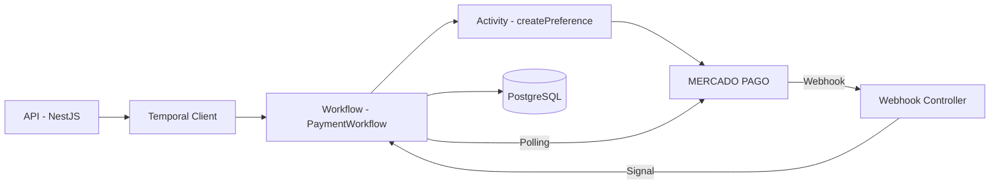

<p align="center">
  <a href="http://nestjs.com/" target="blank"></a>
</p>

<p align="center"><strong>Payments API — NestJS + Temporal.io + Mercado Pago</strong></p>

<p align="center">
  Orquestração de pagamentos assíncronos com workflows duráveis, webhook + signal, polling de fallback e persistência garantida usando 
  <a href="https://nestjs.com" target="_blank">NestJS</a>,
  <a href="https://temporal.io" target="_blank">Temporal.io</a> e
  <a href="https://www.mercadopago.com.br/developers" target="_blank">Mercado Pago</a>.
</p>

<p align="center">
<a href="#"></a>
<a href="#"></a>
<a href="#"></a>
<a href="#"></a>
<a href="LICENSE"></a>
<a href="https://twitter.com/nestframework"></a>
</p>

---

## Description

Payments API é um serviço backend robusto que processa pagamentos utilizando uma combinação poderosa entre:

- **NestJS** → API e lógica de negócio  
- **Temporal.io** → orquestra workflows resilientes  
- **Mercado Pago** → provedor de pagamentos  
- **Webhook + Signals** → encerramento imediato  
- **Polling automático** → fallback caso webhook falhe  

Todo pagamento via cartão inicia um Workflow Temporal que:

1. Cria a preference no Mercado Pago  
2. Retorna a URL imediatamente via Query  
3. Fica aguardando:
   - **Signal** (webhook → finaliza instantaneamente)  
   - **ou Polling** (consulta o status periodicamente)  
4. Atualiza o status no PostgreSQL e encerra  

---

## Project setup

```bash
npm install
```

### Compile and run the project

```bash
# development
npm run start

# watch mode
npm run start:dev

# production
npm run start:prod
```

### Temporal Worker

```bash
npm run start:worker
```

---

# Docker Environment

A API, Temporal e bancos podem rodar totalmente via Docker.

## docker-compose.yml

```yaml
version: "3.8"

services:
  temporal-db:
    image: postgres:14
    environment:
      POSTGRES_USER: temporal
      POSTGRES_PASSWORD: temporal
      POSTGRES_DB: temporal
    volumes:
      - temporal_pgdata:/var/lib/postgresql/data
    ports:
      - "5435:5432"

  temporal:
    image: temporalio/auto-setup:latest
    environment:
      - DB=postgres12
      - POSTGRES_SEEDS=temporal-db
      - POSTGRES_USER=temporal
      - POSTGRES_PWD=temporal
      - DB_PORT=5432
    ports:
      - "7233:7233"
    depends_on:
      - temporal-db

  temporal-ui:
    image: temporalio/ui:latest
    environment:
      - TEMPORAL_ADDRESS=temporal:7233
    ports:
      - "8233:8080"
    depends_on:
      - temporal

volumes:
  temporal_pgdata:
```

---

## Containers gerados ao subir o ambiente

```
NAMES
4f2621913c41   temporalio/ui:latest           "./start-ui-server.sh"   50 minutes ago   Up 50 minutes   0.0.0.0:8233->8080/tcp                     payments-api-temporal-ui-1
47e15c1fa087   temporalio/auto-setup:latest   "/etc/temporal/entry…"   50 minutes ago   Up 50 minutes   0.0.0.0:7233->7233/tcp                     payments-api-temporal-1
b5c59475f28f   postgres:14                    "docker-entrypoint.s…"   50 minutes ago   Up 50 minutes   0.0.0.0:5435->5432/tcp                     payments-api-temporal-db-1
c2f51cea8a3c   postgres:latest                "docker-entrypoint.s…"   3 months ago     Up 7 hours      0.0.0.0:5432->5432/tcp                     core-app-db
5432031ae322   redis:alpine                   "docker-entrypoint.s…"   14 months ago    Up 7 hours      0.0.0.0:6379->6379/tcp                     redis-cp
```

---

## Running the full development environment

Para rodar a Payments API com NestJS + Temporal + Mercado Pago em ambiente local, é necessário manter **vários processos ativos simultaneamente**, cada um rodando em seu próprio terminal.  
Isso é **normal, esperado e faz parte da arquitetura distribuída** do Temporal.

Abaixo, o passo a passo completo:

---

### 🟦 1. Terminal — ngrok (expor o webhook do Mercado Pago)

O Mercado Pago **não consegue acessar localhost**, então você precisa expor o endpoint:

```
/api/payment/mercadopago/webhook
```

Rodando:

```bash
ngrok http 3000
```

Isso gera uma URL pública HTTPS que você coloca no `.env` como:

```
MP_WEBHOOK_URL=https://SEU-NGROK/api/payment/mercadopago/webhook
```

Esse terminal deve ficar **sempre aberto**, porque o ngrok encerra se fechar a janela.

---

### 🟦 2. Terminal — Worker do Temporal

O workflow *não roda* sem o worker.  
Todas as activities como:

- `createPreference`
- `updatePaymentStatus`
- `getPaymentStatus`

executam aqui.

Rodar:

```bash
npm run start:worker
```

Se o worker estiver fechado, o workflow **congela** esperando ele voltar.  
Por isso esse terminal também precisa ficar aberto.

---

### 🟦 3. Terminal — API NestJS

A API recebe todas as requisições externas, cria pagamentos, chama o Temporal Client, e recebe o webhook.

Rodar:

```bash
npm run start:dev
```

Sem a API, você não consegue:

- criar pagamentos
- iniciar workflows
- receber webhook
- mandar signal ao Temporal

---

### 🟦 4. Terminal — Subir o Temporal + Postgres via Docker

Para reiniciar toda a stack:

```bash
docker-compose down -v
docker-compose up
```

Esse terminal mostra os logs do Temporal Server e confirma que:

- Porta **7233** (Temporal Server) está OK  
- Porta **8233** (UI Web) está OK  
- Postgres interno do Temporal está rodando  

---

### 🟦 Resumo final

Para desenvolvimento local, você precisa **exatamente** destes 4 terminais:

| Terminal | Comando | Função |
|---------|----------|--------|
| #1 | `ngrok http 3000` | Expor webhook externo (Mercado Pago) |
| #2 | `npm run start:worker` | Executar workflows/activities do Temporal |
| #3 | `npm run start:dev` | Subir API NestJS |
| #4 | `docker-compose up` | Temporal Server + DB |

---


# Database in Docker

O banco de dados principal do projeto também pode estar rodando via Docker.

Se o banco local roda no container:

```
core-app-db
```

Então o `.env` deve apontar:

```
DB_HOST=localhost
DB_PORT=5432  # ou a porta mapeada
```

---

## Required .env file

Crie um arquivo `.env` na raiz:

```env
DB_HOST=localhost
DB_PORT=5432
DB_USER=admin
DB_PASS=minhasenha123
DB_NAME=payments

MP_ACCESS_TOKEN=APP_USR-234351859721436-120122-63b0f23cf27e184c66ff5d6915c41acb-3032944461
MP_WEBHOOK_URL=https://ursine-jadon-alterably.ngrok-free.dev/api/payment/mercadopago/webhook
```

---

## API Routes

### Criar pagamento

```
POST /api/payment
```

Body:

```json
{
  "cpf": "12345678901",
  "description": "Compra Teste",
  "amount": 90.50,
  "paymentMethod": "CREDIT_CARD"
}
```

### Webhook Mercado Pago

```
POST /api/payment/mercadopago/webhook
```

Processa `data.id` → consulta Mercado Pago → envia Signal → encerra workflow.

### Recuperar pagamento

```
GET /api/payment/:id
```

---

## Workflow Lifecycle (Temporal)

Quando o pagamento é criado:

- Inicia workflow `PaymentWorkflow`
- Chama activity `createPreference`
- Retorna URL via query
- Espera:
  - **Signal (webhook)** → finaliza imediatamente
  - **Polling** → consulta Mercado Pago periodicamente

### Comportamento resiliente

- Se o worker cair → workflow continua após reiniciar  
- Se webhook falhar → polling resolve  
- Se webhook vier duplicado → Temporal ignora  
- Totalmente idempotente  

---

## Architecture Diagram



---

## Folder structure

```bash
src/
 ├── application/
 │   └── payment/
 │       ├── controllers/
 │       ├── services/
 │       └── dto/
 ├── domain/
 ├── infrastructure/
 │   └── persistence/
 └── temporal/
     ├── activities/
     ├── workflows/
     └── worker.ts
test/
```

---

## Resources


Postman collection [Payments API - João.postman_collection.json](https://github.com/user-attachments/files/23877636/Payments.API.-.Joao.postman_collection.json)
```yaml
[Uploading Payments API - João.postman_collection.json…]()
{
	"info": {
		"_postman_id": "c37133b1-74cc-480c-8a4d-2ff8c0736bdc",
		"name": "Payments API - João",
		"schema": "https://schema.getpostman.com/json/collection/v2.0.0/collection.json",
		"_exporter_id": "18995259",
		"_collection_link": "https://jocamoury.postman.co/workspace/capitani~8d38d37e-c48f-4d5f-bd6b-a1a1ae98f6b8/collection/18995259-c37133b1-74cc-480c-8a4d-2ff8c0736bdc?action=share&source=collection_link&creator=18995259"
	},
	"item": [
		{
			"name": "Create Payment - PIX",
			"request": {
				"method": "POST",
				"header": [
					{
						"key": "Content-Type",
						"value": "application/json"
					}
				],
				"body": {
					"mode": "raw",
					"raw": "{\n  \"cpf\": \"12345678901\",\n  \"description\": \"Pagamento PIX teste\",\n  \"amount\": 15,\n  \"paymentMethod\": \"PIX\"\n}"
				},
				"url": "http://localhost:3000/api/payment"
			},
			"response": []
		},
		{
			"name": "Create Payment - CREDIT_CARD",
			"request": {
				"method": "POST",
				"header": [
					{
						"key": "Content-Type",
						"value": "application/json"
					}
				],
				"body": {
					"mode": "raw",
					"raw": "{\n  \"cpf\": \"04123160212\",\n  \"description\": \"Pagamento cartao teste pedro\",\n  \"amount\": 15,\n  \"paymentMethod\": \"CREDIT_CARD\"\n}"
				},
				"url": "http://localhost:3000/api/payment"
			},
			"response": []
		},
		{
			"name": "Get Payment By ID",
			"request": {
				"method": "GET",
				"header": [],
				"url": {
					"raw": "http://localhost:3000/api/payment/:id",
					"protocol": "http",
					"host": [
						"localhost"
					],
					"port": "3000",
					"path": [
						"api",
						"payment",
						":id"
					],
					"variable": [
						{
							"key": "id",
							"value": "062a2161-1cc9-482f-82de-a23462906db4"
						}
					]
				}
			},
			"response": []
		},
		{
			"name": "List Payments",
			"request": {
				"method": "GET",
				"header": [],
				"url": "http://localhost:3000/api/payment"
			},
			"response": []
		},
		{
			"name": "Webhook Mercado Pago (TEST)",
			"request": {
				"method": "POST",
				"header": [
					{
						"key": "Content-Type",
						"value": "application/json"
					}
				],
				"body": {
					"mode": "raw",
					"raw": "{\n  \"data\": {\n    \"id\": \"135489650297\"\n  }\n}"
				},
				"url": "https://ursine-jadon-alterably.ngrok-free.dev/api/payment/mercadopago/webhook"
			},
			"response": []
		}
	]
}
```


NestJS → https://docs.nestjs.com  
Temporal → https://docs.temporal.io  
Mercado Pago Dev → https://www.mercadopago.com.br/developers  
Discord NestJS → https://discord.gg/G7Qnnhy  

---

## Stay in touch

Author — João Vitor Lemos  
---

## License

MIT © 2025
